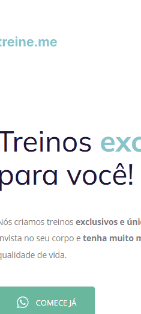
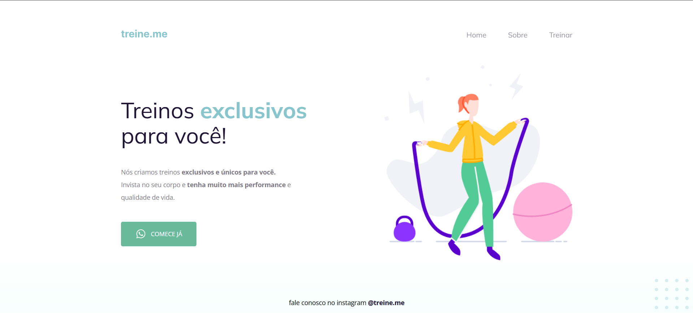

# Projeto 02 3


# Sobre o projeto

Link para utilizar o projeto: Em breve

Este projeto foi realizado como desafio durante as aulas na trilha Explorer, referente ao curso em programação Web para iniciantes da escola [®Rocketseat](https://www.rocketseat.com.br/).

O objetivo deste pequeno projeto foi simular um projeto semanticamente incorreto, como base o seguinte [projeto](https://github.com/gmartinssilva/projeto_02) que foi trabalhado nas aulas. Através de um código inicial na plataforma, desconfigurado propositalmente.

Para utilizar o projeto
não é necessário realizar a instalação de nenhuma biblioteca adicional, basta um navegador.

## Layout mobile


## Layout web


# Tecnologias utilizadas
- HTML
- CSS

# Como executar o projeto
```bash
# clonar repositório
git clone https://github.com/gmartinssilva/projeto_02_3.git

# Entrar na pasta do projeto e abrir o arquivo index.html no seu navegador
```

# Autor

Gabriel Martins Silva

https://www.linkedin.com/in/gabrielmartinssilva/

# Referências

[Badges](https://github.com/Ileriayo/markdown-badges)
